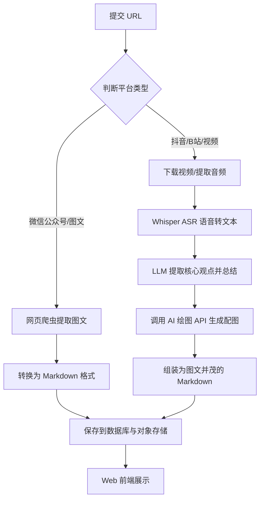

## 1. 产品概述
这是一款自动化的 AI 资讯聚合与生成 Web 平台。用户可以提交来自各大平台（如微信公众号、抖音、B站、X等）的图文或视频链接。系统会自动识别链接类型：对于图文类（如微信公众号文章），系统将精准抓取内容并原样转换为 Markdown 格式；对于视频类（如抖音、B站短视频），系统将自动提取音频、使用 ASR（语音识别）转换为文本，然后通过大语言模型（LLM）进行分析总结，并自动配图，最终生成一篇结构化的 Markdown 文章发布到网站上。
- **主要目的**：实现 AI 资讯的自动化搜集、总结与沉淀，打造个人的 AI 知识库。
- **目标用户**：AI 领域研究者、内容创作者、科技爱好者。
- **产品价值**：大幅降低信息获取与整理的成本，将碎片化的短视频和长篇公众号文章转化为高效易读的图文 Markdown 笔记。

## 2. 核心功能

### 2.1 用户角色
| 角色 | 注册方式 | 核心权限 |
|------|---------------------|------------------|
| 管理员 (Admin) | 预设账号/密码登录 | 提交内容链接、管理生成的文章、查看处理进度 |
| 普通访客 (Guest) | 无需注册 | 浏览网站首页、阅读生成的 Markdown 文章 |

### 2.2 功能模块
1. **首页 (Home Page)**：Hero 展示区、最新 AI 资讯文章瀑布流/网格列表、分类导航。
2. **文章详情页 (Details Page)**：Markdown 渲染区（支持代码高亮、图文混排）、来源链接跳转。
3. **管理控制台 (Admin Dashboard)**：URL 输入与提交流水线、处理任务状态监控、文章草稿管理。

### 2.3 页面详情
| 页面名称 | 模块名称 | 功能描述 |
|-----------|-------------|---------------------|
| 首页 | Hero 展示区 | 展示最新的高质量 AI 资讯或特色推荐，包含吸睛的标题和生成的封面图。 |
| 首页 | 文章列表 | 按时间倒序展示已生成的 Markdown 文章，包含标题、摘要、封面、来源平台（微信/B站等）标签。 |
| 详情页 | MD 渲染区 | 渲染 Markdown 内容，顶部包含标题、生成时间、原始链接按钮；正文包含总结内容及 AI 生成的配图。 |
| 控制台 | 链接提交区 | 提供一个输入框，用户粘贴 URL，点击提交后触发后台爬虫和 AI 处理流程。 |
| 控制台 | 任务状态区 | 实时显示链接处理进度（如：正在抓取 -> 正在提取音频 -> 正在生成摘要 -> 正在生成图片 -> 处理完成）。 |

## 3. 核心流程
1. 管理员在控制台提交资讯链接。
2. 后端识别链接来源（图文 or 视频）。
3. 执行对应的数据处理 Pipeline。
4. 将处理后的图文内容转换为 Markdown 并存入数据库。
5. 前端获取最新数据并渲染展示。

## 4. 用户界面设计

### 4.1 设计风格
- **主色调**：科技感深色模式 (Dark Mode)，背景使用深灰/纯黑 (e.g., `#0F172A`)，搭配赛博朋克风格的点缀色（如霓虹蓝 `#3B82F6` 或荧光绿 `#10B981`）。
- **字体**：标题使用具有现代感和几何特征的无衬线字体（如 Inter 或 Space Grotesk），正文排版注重阅读体验。
- **布局风格**：Bento Box（便当盒）卡片布局，大圆角、毛玻璃效果 (Glassmorphism)、细微的渐变边框。
- **动效**：页面滚动时卡片淡入上浮，卡片悬停时发光效果 (Glow effect)。

### 4.2 页面设计概述
| 页面名称 | 模块名称 | UI 元素 |
|-----------|-------------|-------------|
| 首页 | 导航栏 | 极简顶部导航，毛玻璃背景，包含 Logo 和暗黑模式切换。 |
| 首页 | Hero 区 | 动态渐变背景，大号加粗字体 Slogan，吸引眼球。 |
| 首页 | 资讯网格 | Masonry (瀑布流) 或 Grid 布局，每张卡片包含悬停放大效果、来源 Icon、AI 摘要。 |
| 详情页 | 阅读区 | 居中窄排版 (类似 Medium)，Markdown 优雅渲染，字体字号适中，图片带有圆角和阴影。 |
| 控制台 | 提交面板 | 发光的 Input 输入框，带加载动画 (Loading Spinner) 的提交按钮，步骤进度条组件。 |

### 4.3 响应式设计
桌面端优先 (Desktop-first)，通过 CSS Grid 和 Flexbox 完美适配平板和移动端，移动端下瀑布流转为单列显示，导航栏收起为汉堡菜单。
