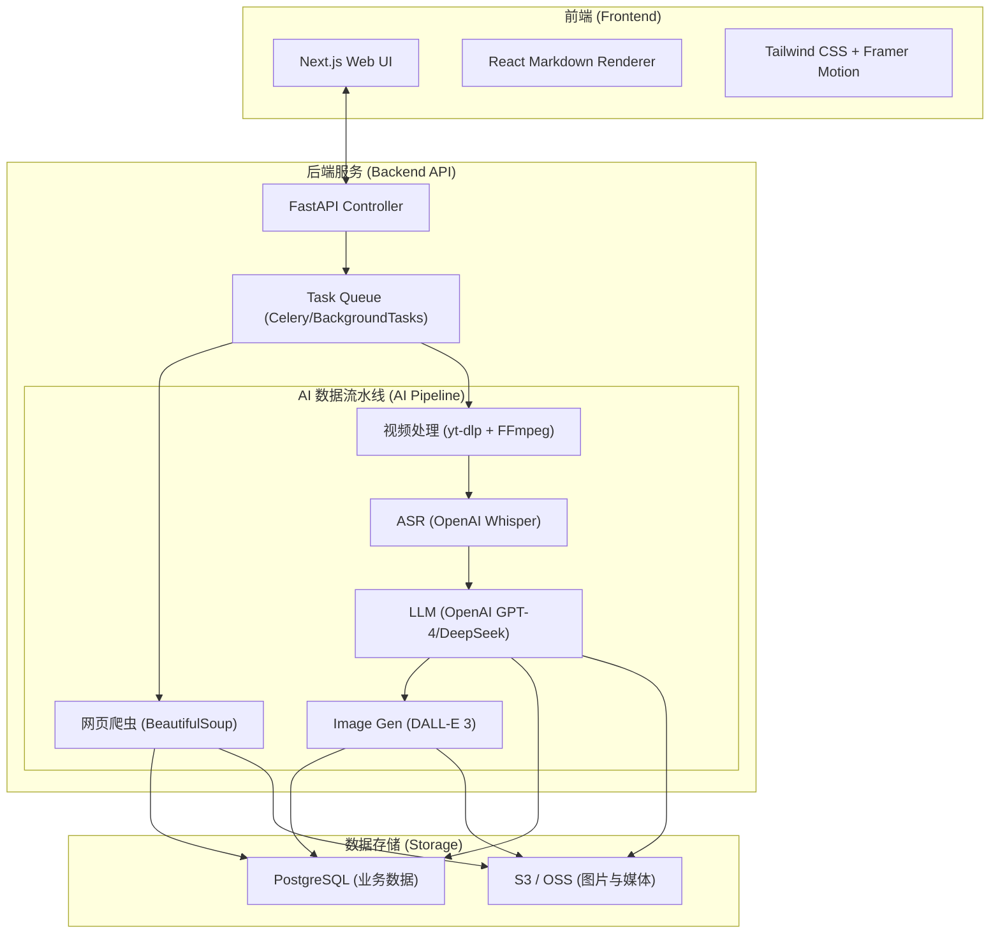
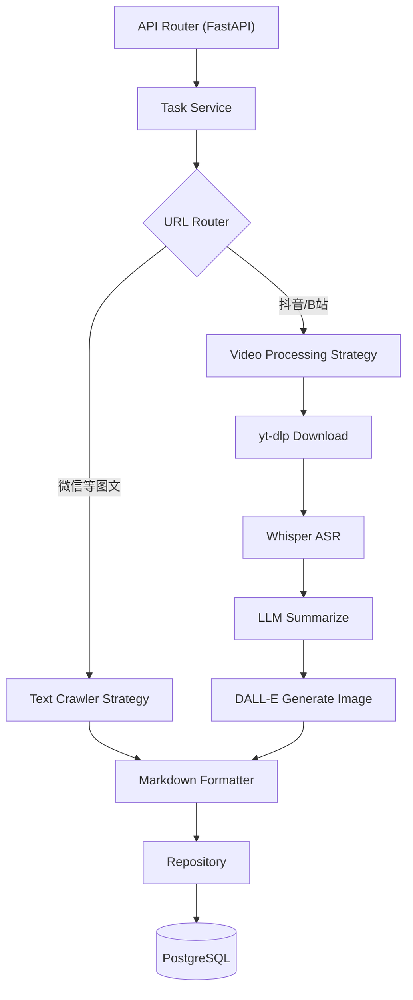
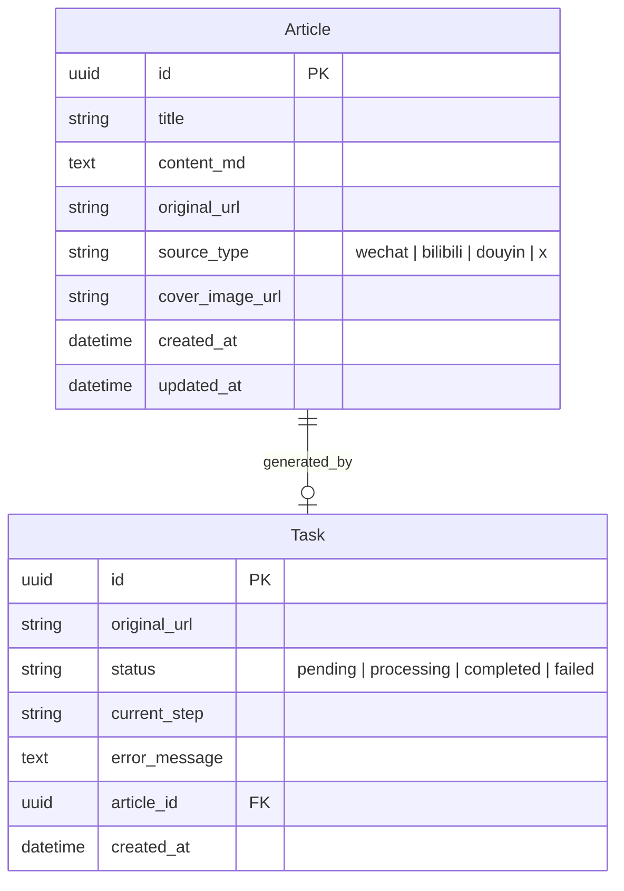

## 1. 架构设计
项目采用前后端分离架构，结合 AI 处理流水线。由于涉及视频下载、音视频处理 (FFmpeg)、语音识别 (Whisper) 和网页爬虫，后端强烈推荐使用 Python 生态，而前端则使用 React/Next.js 以获得极致的用户体验和 SEO。



## 2. 技术说明
- **前端架构**: 
  - 框架: Next.js (App Router), React 18
  - 样式: Tailwind CSS 3, Framer Motion (动效), Lucide React (图标)
  - Markdown: `react-markdown`, `remark-gfm`, `rehype-highlight` (或类似代码高亮库)
- **后端架构**:
  - 框架: Python 3.10+配合 FastAPI
  - ORM: SQLAlchemy 或 Prisma Python
  - 爬虫与下载: `newspaper3k` / `BeautifulSoup` (图文), `yt-dlp` (视频/音频下载)
  - AI 引擎: OpenAI SDK (调用 GPT 模型总结、Whisper API 转录、DALL-E 3 绘图)
- **数据库**: PostgreSQL
- **部署**: Docker 容器化部署

## 3. 路由定义
| 路由 | 目的 |
|-------|---------|
| `/` | 首页，展示生成的 AI 资讯列表 |
| `/article/[id]` | 文章详情页，展示 Markdown 渲染结果 |
| `/admin` | 管理后台，用于提交 URL 链接和监控处理任务 |

## 4. API 定义
前端通过 RESTful API 与 Python 后端交互。

```typescript
// 提交链接处理任务
POST /api/v1/tasks/submit
Request: { url: string }
Response: { task_id: string, status: "pending" }

// 获取任务处理状态 (轮询或 WebSocket)
GET /api/v1/tasks/{task_id}/status
Response: { 
  task_id: string, 
  status: "processing" | "completed" | "failed", 
  step: string, // "downloading_video" | "extracting_audio" | "generating_markdown"
  article_id?: string 
}

// 获取文章列表
GET /api/v1/articles?page=1&limit=20
Response: {
  total: number,
  data: Array<{
    id: string,
    title: string,
    source_type: "wechat" | "video",
    cover_image: string,
    created_at: string
  }>
}

// 获取文章详情
GET /api/v1/articles/{id}
Response: {
  id: string,
  title: string,
  content_md: string,
  original_url: string,
  source_type: string,
  created_at: string
}
```

## 5. 服务端架构图


## 6. 数据模型

### 6.1 数据模型定义


### 6.2 数据定义语言 (DDL)
```sql
CREATE TABLE articles (
    id UUID PRIMARY KEY DEFAULT gen_random_uuid(),
    title VARCHAR(255) NOT NULL,
    content_md TEXT NOT NULL,
    original_url TEXT NOT NULL,
    source_type VARCHAR(50) NOT NULL,
    cover_image_url TEXT,
    created_at TIMESTAMP WITH TIME ZONE DEFAULT CURRENT_TIMESTAMP,
    updated_at TIMESTAMP WITH TIME ZONE DEFAULT CURRENT_TIMESTAMP
);

CREATE TABLE tasks (
    id UUID PRIMARY KEY DEFAULT gen_random_uuid(),
    original_url TEXT NOT NULL,
    status VARCHAR(50) NOT NULL DEFAULT 'pending',
    current_step VARCHAR(100),
    error_message TEXT,
    article_id UUID REFERENCES articles(id) ON DELETE SET NULL,
    created_at TIMESTAMP WITH TIME ZONE DEFAULT CURRENT_TIMESTAMP
);

CREATE INDEX idx_articles_created_at ON articles(created_at DESC);
CREATE INDEX idx_articles_source_type ON articles(source_type);
```
